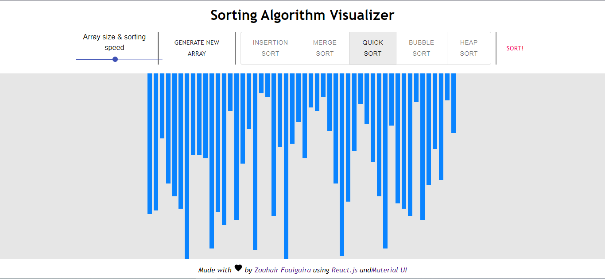

# Sorting Algorithm Visualizer



## Overview

The Sorting Algorithm Visualizer is a web application that allows users to interactively visualize various sorting algorithms in real-time. It provides a dynamic and educational way to understand how algorithms like Bubble Sort, Quick Sort, Merge Sort, and more operate.

### Live Demo

🌐 [Sorting Algorithm Visualizer Demo](https://sorting-algorithm-visualizer-z.netlify.app/)

## Features

- **Real-time Visualization:** Witness the sorting algorithms in action with a live, interactive display.
- **Responsive Design:** Enjoy a seamless experience on different devices, from desktops to mobile devices.
- **User-Friendly Interface:** Easily adjust array size, sorting speed, and choose different algorithms.
- **Multiple Sorting Algorithms:** Currently supports Bubble Sort, Quick Sort, Merge Sort, and more.

## How to Use

1. Access the live demo [here](https://sorting-algorithm-visualizer-z.netlify.app/).
2. Adjust the array size and sorting speed using the sliders.
3. Choose a sorting algorithm from the provided options.
4. Click the "Generate New Array" button to create a random array.
5. Click "Sort!" to see the algorithm in action.

## Installation

To run the Sorting Algorithm Visualizer locally, follow these steps:

1. Clone the repository:

```bash
git clone https://github.com/ZOUHAIRFGRA/sorting-algorithm-visualizer.git
